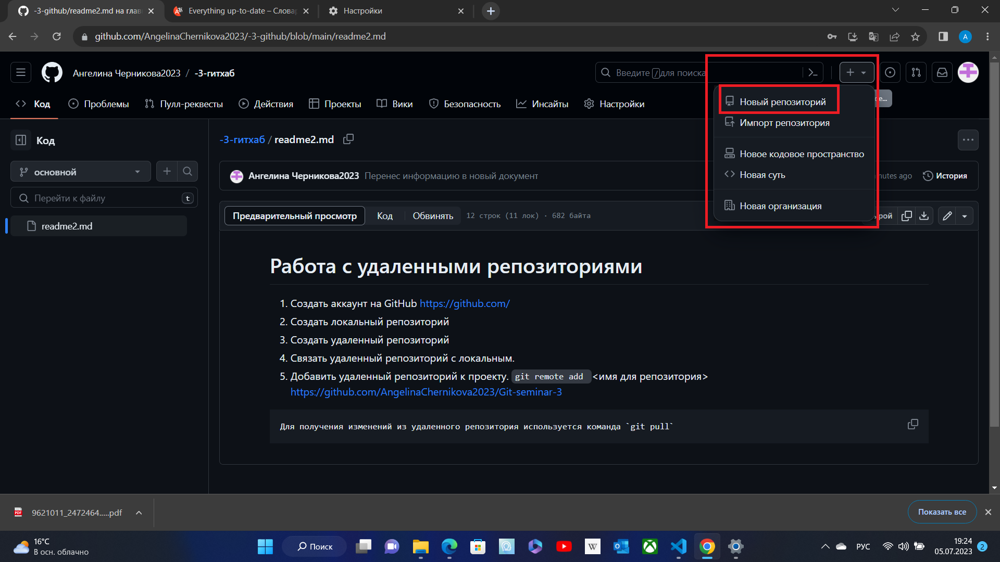

# Работа с удаленными репозиториями 
1. Создать аккаунт на GitHub
https://github.com/
2. Создать локальный репозиторий
3. Создать удаленный репозиторий
Создать на сайте https://github.com/ репозиторий 



4. Связать удаленный репозиторий с локальным.
6. Добавить удаленный репозиторий к проекту.
`git remote add ` <имя для репозитория> https://github.com/AngelinaChernikova2023/Git-seminar-3

```
Для получения изменений из удаленного репозитория используется команда `git pull`
```